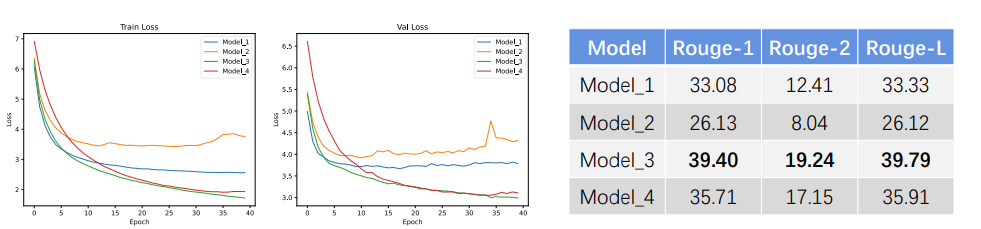

## 基于BiLSTM的生成式文本摘要模型

本项目使用了一个基于BiLSTM Encoder  /  LSTM Decoder Seq2Seq的文本摘要模型，通过相对较轻量化的模型，实现可观的生成式文本摘要效果，并可能用于移动部署。

### DEMO地址：[TommyIX/SIMPRead: A Chrome Extension based on TextSUM Deep Learning model and piggyreader for easier and better text browsing (github.com)](https://github.com/TommyIX/SIMPRead)


#### 项目文件结构

* alter_models：内含自对比实验使用的各个模型，详见其内部的README
* data：内含用于训练的轻量新闻数据集
* utils：内含辅助的工具代码，详见其内部的README
  * Evaluate.ipynb：提供可修改的单句，可以自由输入句子进行验证
  * Evaluate_once.py：提供使用单句进行单次eval的py代码
  * Generate_ValSet_Output.py：通过data中的val.csv调用模型批量导出其输出，用于Rogue评估
  * model_ebldl.py：定义模型代码，无需修改
  * PreProcess.py：预处理数据代码，无需修改
  * train.py： 模型训练代码


#### 环境要求

dill
spacy
torch\==1.9.0
torchtext\==0.10.1

```bash
pip -r requirements.txt
```


#### 配置运行

打开train.py修改epoch_num与batch_size，必要时加入os.environ["CUDA_VISIBLE_DEVICES"] = "x"，其中x为您的GPU编号，即可启动训练。

权重文件自动保存为model.pth。eval代码可以自行选择权重文件（更改目录即可），或者自动调用同目录下的model.pth

eval_once更改测试文本即可使用


#### 自对比实验结果




#### 下载预训练权重

迅雷云盘：链接：https://pan.xunlei.com/s/VMdUtXVKXvcpzS7W8JL6-UunA1  提取码：8kaz

谷歌云端硬盘：https://drive.google.com/file/d/1-bSlatGXlP37UEtTwaEfOk-6KT2oMcpJ/view?usp=sharing

下载后放在与训练目录同一目录（保持名字为model.pth）即可使用

